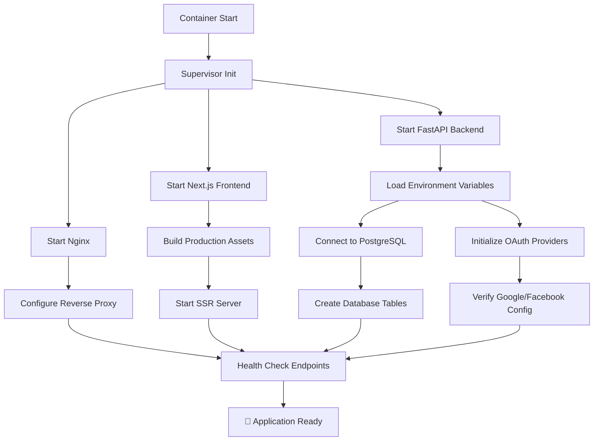
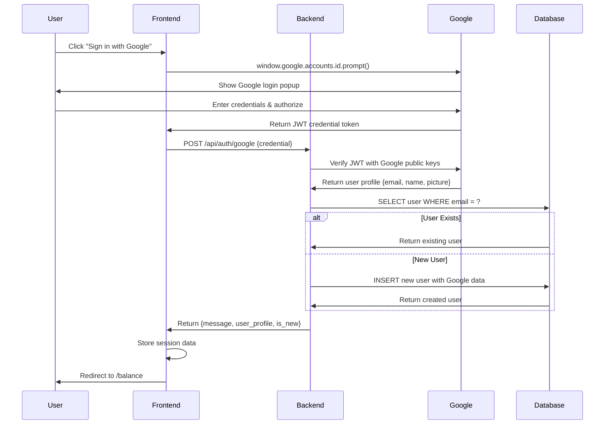
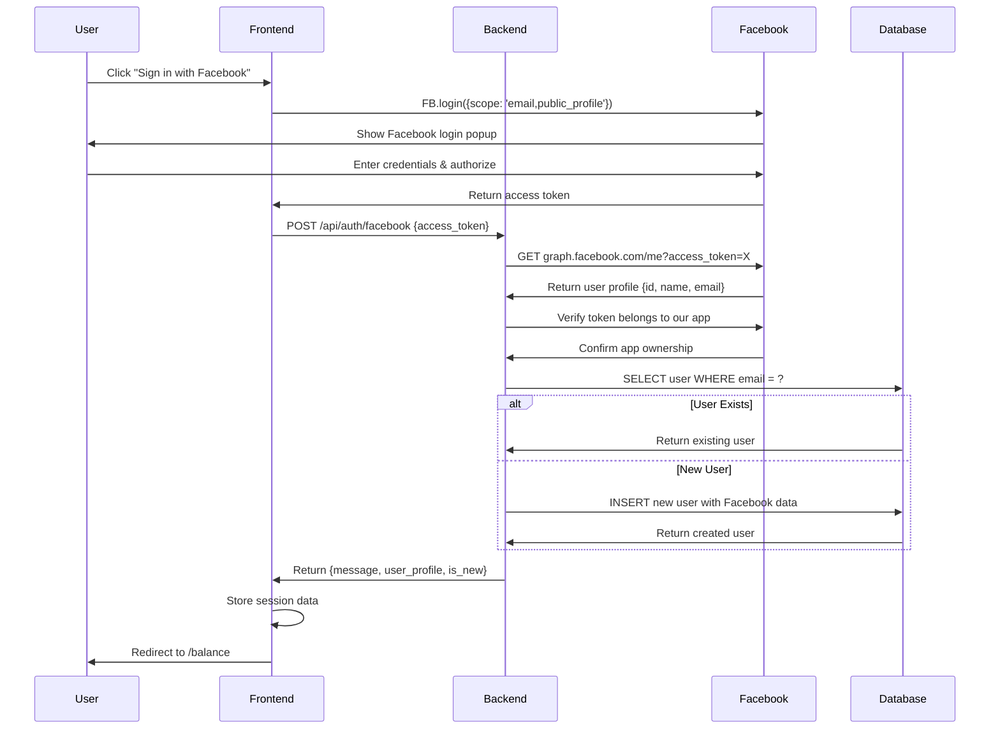
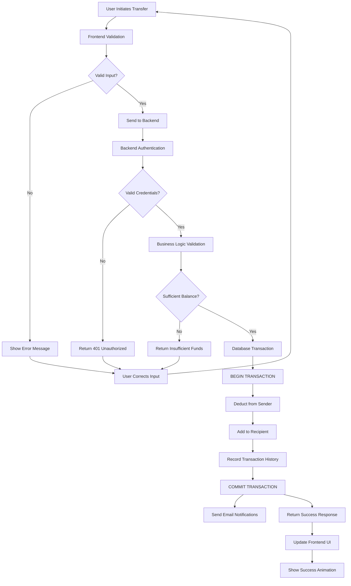
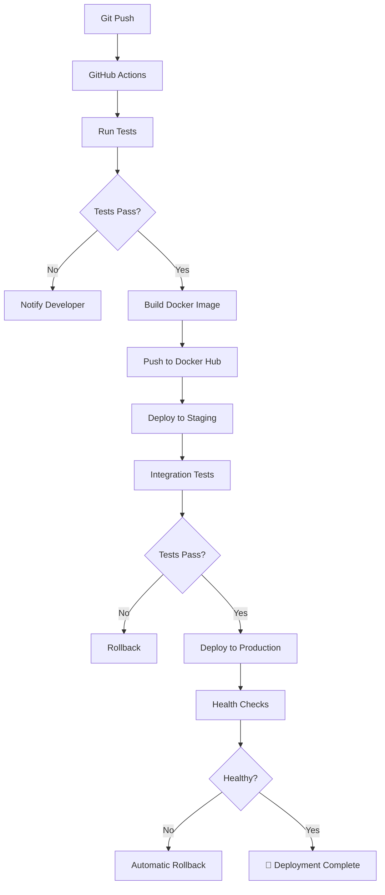

# 🏗️ BlueBank - Detailed Architectural Workflow & Design

## 📋 **Architecture Overview**

BlueBank follows a **modern microservices architecture** with containerized deployment, leveraging cloud-native technologies for scalability, security, and maintainability.

---

## 🔄 **System Architecture Layers**

### **🌐 Presentation Layer (Frontend)**
```typescript
Technology Stack:
├── Next.js 14 (React 18)          # Server-side rendering framework
├── TypeScript                     # Type-safe JavaScript
├── Tailwind CSS                   # Utility-first CSS framework
├── React Hooks                    # State management
├── Context API                    # Global state (Dark mode)
└── Progressive Web App (PWA)      # Mobile-first design

Key Components:
├── Authentication Pages           # Login, Register, OAuth callbacks
├── Banking Operations             # Deposit, Withdraw, Transfer
├── User Dashboard                 # Balance, Transaction history
├── Profile Management             # User settings, preferences
└── Responsive UI                  # Mobile, tablet, desktop
```

### **⚙️ Application Layer (Backend)**
```python
Technology Stack:
├── FastAPI                        # High-performance async Python framework
├── Pydantic                       # Data validation and serialization
├── SQLAlchemy                     # Database ORM (optional)
├── Async/Await                    # Non-blocking I/O operations
├── Passlib + bcrypt              # Password hashing
└── JWT + OAuth 2.0               # Authentication tokens

API Architecture:
├── RESTful Endpoints             # Standard HTTP methods
├── Request/Response Models       # Pydantic schemas
├── Middleware Pipeline           # CORS, Authentication, Logging
├── Error Handling               # Standardized error responses
└── Background Tasks             # Email notifications, cleanup
```

### **💾 Data Layer (Database)**
```sql
Database Design:
├── PostgreSQL 13+               # Primary relational database
├── ACID Transactions           # Data consistency guarantees
├── Connection Pooling          # Efficient resource management
├── Automated Backups          # Daily snapshots with 7-day retention
└── Encryption at Rest         # AWS RDS encryption

Schema Architecture:
users (
    id SERIAL PRIMARY KEY,
    email VARCHAR(255) UNIQUE NOT NULL,
    username VARCHAR(100) UNIQUE NOT NULL,
    display_name VARCHAR(255),
    password_hash VARCHAR(255),
    balance DECIMAL(10,2) DEFAULT 0.00,
    oauth_provider VARCHAR(50),        # 'google', 'facebook', or null
    oauth_id VARCHAR(255),             # External OAuth user ID
    created_at TIMESTAMP DEFAULT CURRENT_TIMESTAMP,
    updated_at TIMESTAMP DEFAULT CURRENT_TIMESTAMP
)

transactions (
    id SERIAL PRIMARY KEY,
    user_id INTEGER REFERENCES users(id),
    type VARCHAR(50) NOT NULL,         # 'deposit', 'withdraw', 'transfer'
    amount DECIMAL(10,2) NOT NULL,
    recipient_id INTEGER,              # For transfers
    description TEXT,
    status VARCHAR(20) DEFAULT 'completed',
    created_at TIMESTAMP DEFAULT CURRENT_TIMESTAMP
)
```

### **🔐 Security Layer**
```yaml
Authentication & Authorization:
├── OAuth 2.0 Integration:
│   ├── Google OAuth (JWT tokens)
│   ├── Facebook OAuth (Access tokens)
│   └── Token verification with provider APIs
├── Session Management:
│   ├── Secure session storage
│   ├── Session timeout policies
│   └── Cross-site request forgery (CSRF) protection
└── Input Validation:
    ├── SQL injection prevention (parameterized queries)
    ├── XSS protection (input sanitization)
    ├── Rate limiting (API endpoint protection)
    └── Amount validation (business logic protection)

Network Security:
├── HTTPS/TLS 1.3 (Cloudflare SSL)
├── CORS Policy (Origin restrictions)
├── Firewall Rules (IP whitelisting)
├── VPC Security Groups (Database isolation)
└── DDoS Protection (Cloudflare)
```

### **☁️ Infrastructure Layer**
```yaml
Cloud Architecture:
├── AWS Lightsail:
│   ├── Ubuntu Linux Instance
│   ├── 1 vCPU, 2GB RAM, 40GB SSD
│   ├── Static IP: 99.79.69.130
│   └── Firewall: Ports 22, 80, 443
├── AWS RDS PostgreSQL:
│   ├── db.t3.micro instance
│   ├── 20GB storage with auto-scaling
│   ├── Automated backups (7-day retention)
│   └── Security group (Lightsail IP only)
└── Cloudflare:
    ├── DNS management
    ├── SSL/TLS termination
    ├── CDN caching
    └── DDoS protection

Containerization:
├── Docker Multi-stage Build:
│   ├── Frontend build stage (Node.js)
│   ├── Backend setup stage (Python)
│   └── Production runtime stage (Ubuntu)
├── Supervisor Process Manager:
│   ├── Nginx (reverse proxy)
│   ├── Next.js (frontend server)
│   └── FastAPI (backend server)
└── Container Registry:
    └── Docker Hub: chenhexu/bluebank:latest
```

---

## 🔄 **Detailed Workflow Processes**

### **1. 🚀 Application Startup Workflow**



### **2. 🔐 OAuth Authentication Workflow**

#### **Google OAuth Flow**


#### **Facebook OAuth Flow**


### **3. 💰 Banking Operation Workflow**

#### **Money Transfer Process**


### **4. 📊 Data Flow Architecture**

#### **Request Processing Pipeline**

```mermaid
graph LR
    subgraph "🌐 Client Side"
        US[User Action]
        UI[UI Component]
        ST[State Management]
    end
    
    subgraph "🔒 Security Layer"
        CF[Cloudflare]
        FW[Firewall]
        SSL[SSL/TLS]
    end
    
    subgraph "⚙️ Server Side"
        NG[Nginx Proxy]
        MW[Middleware]
        EP[API Endpoint]
        BL[Business Logic]
    end
    
    subgraph "💾 Data Layer"
        CP[Connection Pool]
        DB[(PostgreSQL)]
        BK[Backup Storage]
    end
    
    US --> UI
    UI --> ST
    ST --> CF
    CF --> SSL
    SSL --> FW
    FW --> NG
    NG --> MW
    MW --> EP
    EP --> BL
    BL --> CP
    CP --> DB
    DB --> BK
    
    %% Response flow (reverse)
    DB --> CP
    CP --> BL
    BL --> EP
    EP --> MW
    MW --> NG
    NG --> FW
    FW --> SSL
    SSL --> CF
    CF --> ST
    ST --> UI
    UI --> US
```


---

## 🛠️ **Technology Integration Points**

### **Frontend-Backend Communication**
```typescript
// API Client Architecture
class APIClient {
    private baseURL = process.env.NEXT_PUBLIC_API_URL || 'http://localhost:8000';
    
    async authenticate(provider: 'google' | 'facebook', credentials: any) {
        const response = await fetch(`${this.baseURL}/api/auth/${provider}`, {
            method: 'POST',
            headers: { 'Content-Type': 'application/json' },
            body: JSON.stringify(credentials)
        });
        return response.json();
    }
    
    async bankingOperation(operation: string, data: any) {
        return this.post(`/api/${operation}`, data);
    }
}

// State Management with React Context
const AppContext = createContext({
    user: null,
    isAuthenticated: false,
    darkMode: false,
    balance: 0
});
```

### **Backend Service Architecture**
```python
# Service Layer Pattern
class AuthenticationService:
    def __init__(self, db_connection, oauth_providers):
        self.db = db_connection
        self.google = oauth_providers['google']
        self.facebook = oauth_providers['facebook']
    
    async def authenticate_oauth(self, provider: str, token: str):
        # Verify token with provider
        user_profile = await self.verify_token(provider, token)
        # Create or retrieve user
        user = await self.create_or_get_user(user_profile)
        return user

class BankingService:
    def __init__(self, db_connection, notification_service):
        self.db = db_connection
        self.notifications = notification_service
    
    async def transfer_money(self, from_user, to_user, amount):
        async with self.db.transaction():
            # Atomic operation ensures consistency
            await self.deduct_balance(from_user, amount)
            await self.add_balance(to_user, amount)
            await self.record_transaction(from_user, to_user, amount)
        
        # Send notifications after successful transaction
        await self.notifications.send_transfer_confirmation(from_user, to_user, amount)
```

---

## 📈 **Performance & Scalability Design**

### **Current Performance Metrics**
```yaml
Response Times:
├── API Endpoints: <200ms average
├── Database Queries: <50ms average
├── OAuth Verification: <500ms
├── Page Load Time: <2 seconds
└── Balance Updates: Real-time (<100ms)

Scalability Limits:
├── Single Container: ~100 concurrent users
├── Database Connections: 20 connection pool
├── Memory Usage: ~1GB under normal load
├── Storage: 40GB with auto-scaling
└── Bandwidth: 1TB/month included
```

### **Optimization Strategies**
```yaml
Frontend Optimizations:
├── Next.js SSR: Faster initial page loads
├── Code Splitting: Reduced bundle sizes
├── Image Optimization: WebP format with lazy loading
├── Caching Strategy: Browser + CDN caching
└── PWA Features: Offline capability

Backend Optimizations:
├── Async Processing: Non-blocking I/O operations
├── Connection Pooling: Efficient database connections
├── Query Optimization: Indexed database queries
├── Response Compression: Gzip compression
└── Background Tasks: Email sending, cleanup jobs

Infrastructure Optimizations:
├── CDN: Cloudflare global edge locations
├── Database: Read replicas for scaling
├── Container: Multi-stage builds for smaller images
├── Monitoring: Health checks and auto-restart
└── Caching: Redis for session storage (future)
```

---

## 🔧 **Deployment & DevOps Workflow**

### **CI/CD Pipeline (Future Implementation)**


### **Current Manual Deployment**
```bash
# Local Development
npm run dev          # Frontend development server
uvicorn main:app --reload  # Backend development server

# Docker Build & Deploy
docker build -t chenhexu/bluebank:latest .
docker push chenhexu/bluebank:latest
docker pull chenhexu/bluebank:latest
docker run -d -p 80:80 --name bluebank chenhexu/bluebank:latest

# Production Health Check
curl https://bluebank.unifra.org/api/health
```

---

## 🔍 **Monitoring & Observability**

### **Application Monitoring**
```yaml
Logging Strategy:
├── Application Logs: /var/log/supervisor/
│   ├── backend.log: API requests, database operations
│   ├── frontend.log: SSR errors, build issues
│   └── nginx.log: HTTP requests, proxy errors
├── Security Logs: Authentication attempts, failed logins
├── Performance Logs: Response times, database queries
└── Error Tracking: Exception details, stack traces

Health Monitoring:
├── Container Health: Docker container status
├── Process Health: Supervisor service monitoring
├── Database Health: Connection pool status
├── External Services: OAuth provider availability
└── Resource Usage: CPU, memory, disk space
```

### **Alerting Strategy (Future)**
```yaml
Critical Alerts:
├── Application Down: 30 seconds
├── Database Unavailable: 60 seconds
├── High Error Rate: >5% in 5 minutes
├── Memory Usage: >90% for 5 minutes
└── Disk Space: >85% usage

Warning Alerts:
├── Slow Responses: >500ms average for 10 minutes
├── OAuth Failures: >10% failure rate
├── High CPU: >80% for 15 minutes
└── Unusual Traffic: 3x normal volume
```

---

## 🎯 **Architecture Benefits & Trade-offs**

### **✅ Benefits**
- **Scalability**: Microservices can scale independently
- **Maintainability**: Clear separation of concerns
- **Security**: Multiple layers of protection
- **Performance**: Async processing and optimized queries
- **Reliability**: Automated backups and health monitoring
- **Developer Experience**: Fast development with hot reloading

### **⚠️ Trade-offs**
- **Complexity**: More moving parts to manage
- **Single Point of Failure**: Single container deployment
- **Cost**: Multiple AWS services (estimated $25/month)
- **Latency**: OAuth verification adds network overhead
- **Maintenance**: Regular updates and security patches required

---

## 🚀 **Future Architecture Evolution**

### **Phase 1: Current State** ✅
- Single container deployment
- Basic OAuth integration
- Simple database design
- Manual deployment process

### **Phase 2: Enhanced Security** (Next)
- Rate limiting implementation
- Advanced input validation
- Security monitoring
- Automated security testing

### **Phase 3: Microservices** (Future)
- Separate authentication service
- Dedicated banking service
- Message queue for async operations
- Service mesh for communication

### **Phase 4: Enterprise Scale** (Future)
- Kubernetes orchestration
- Auto-scaling policies
- Multi-region deployment
- Advanced monitoring and analytics

---

**🎯 This architecture provides a solid foundation for a modern, secure, and scalable banking application while maintaining simplicity for development and deployment.**

*Last Updated: August 19, 2025*