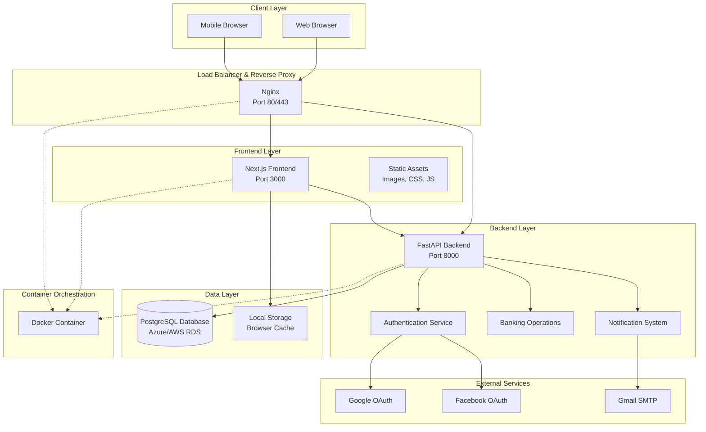
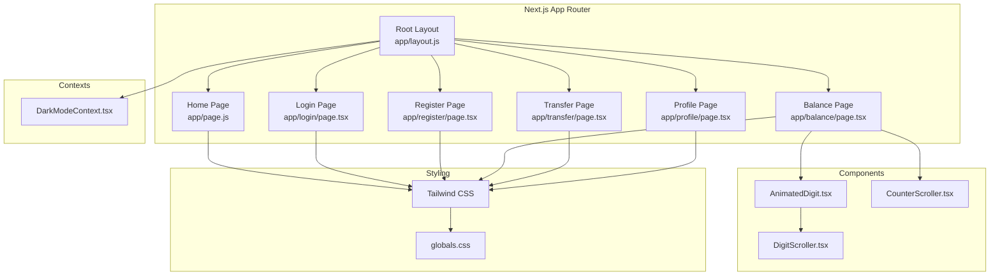
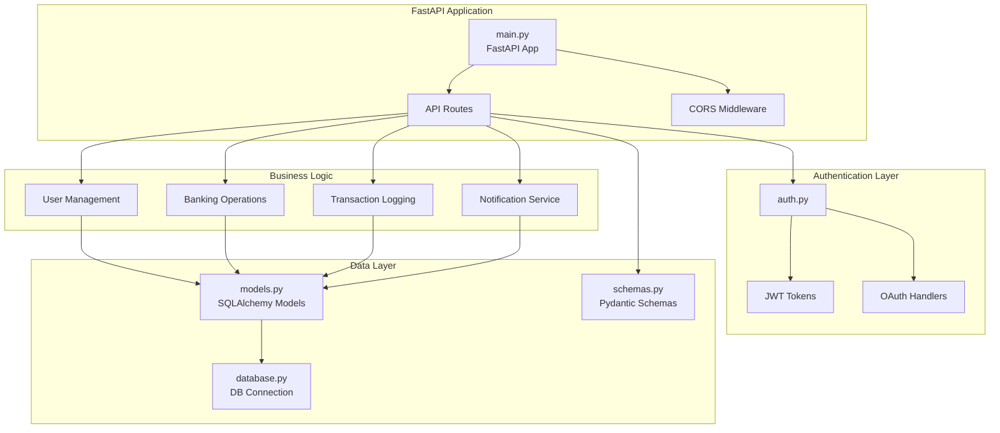
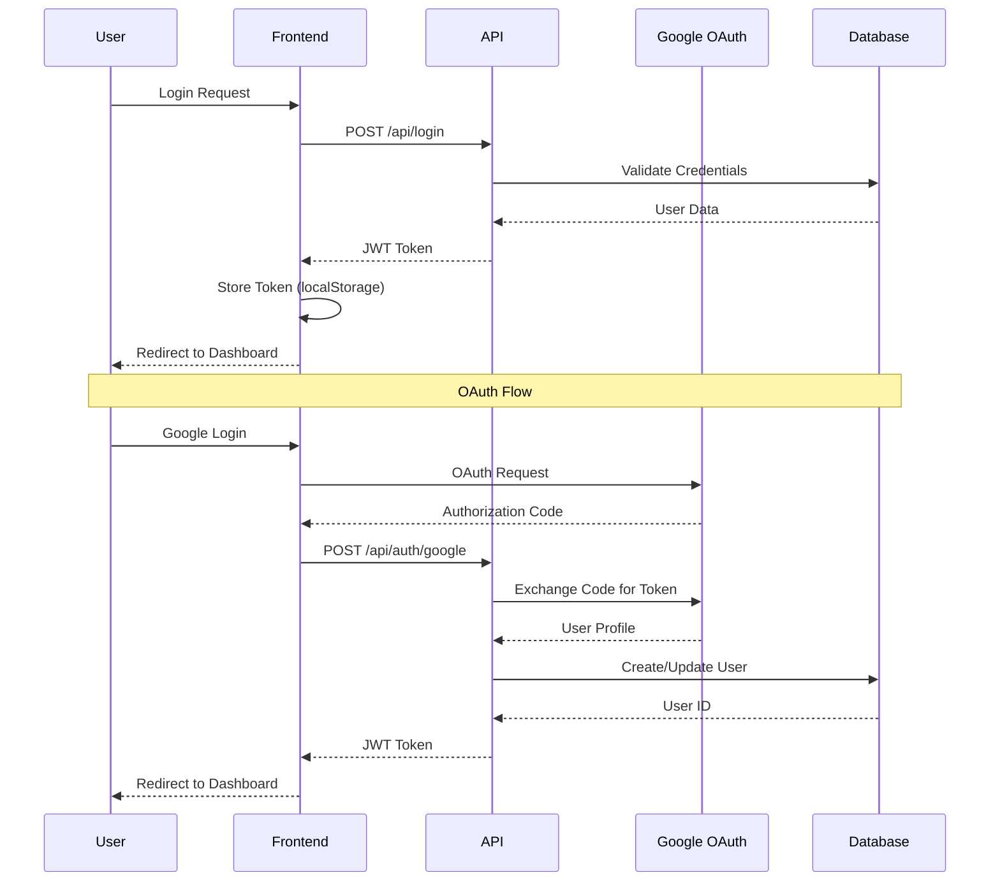
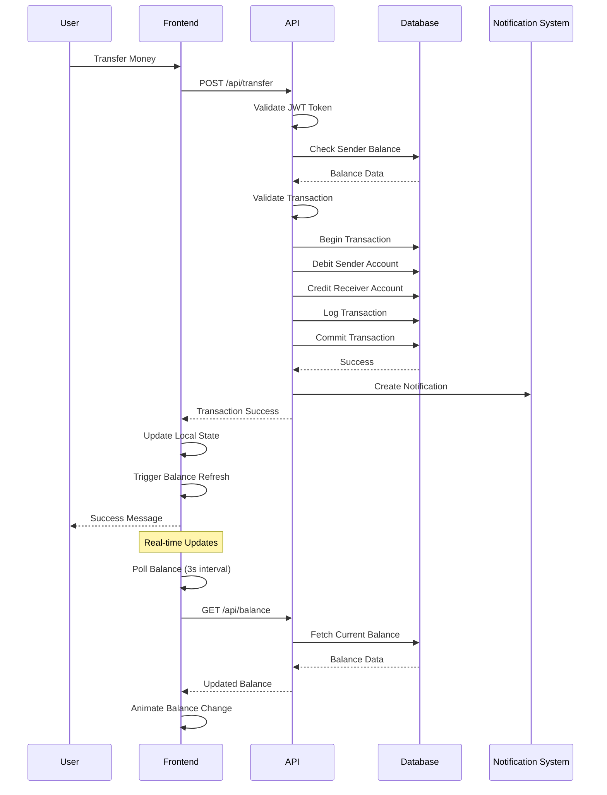
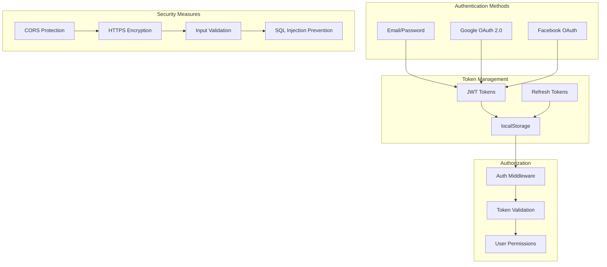
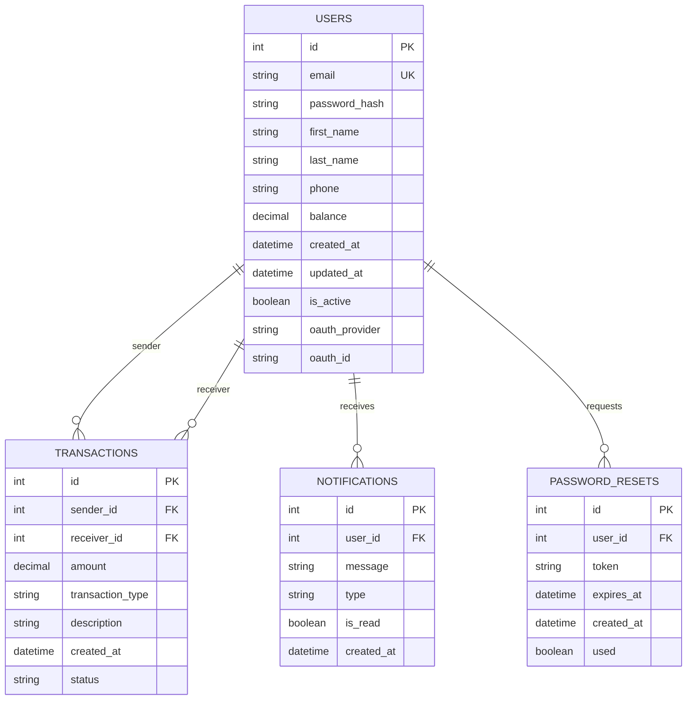
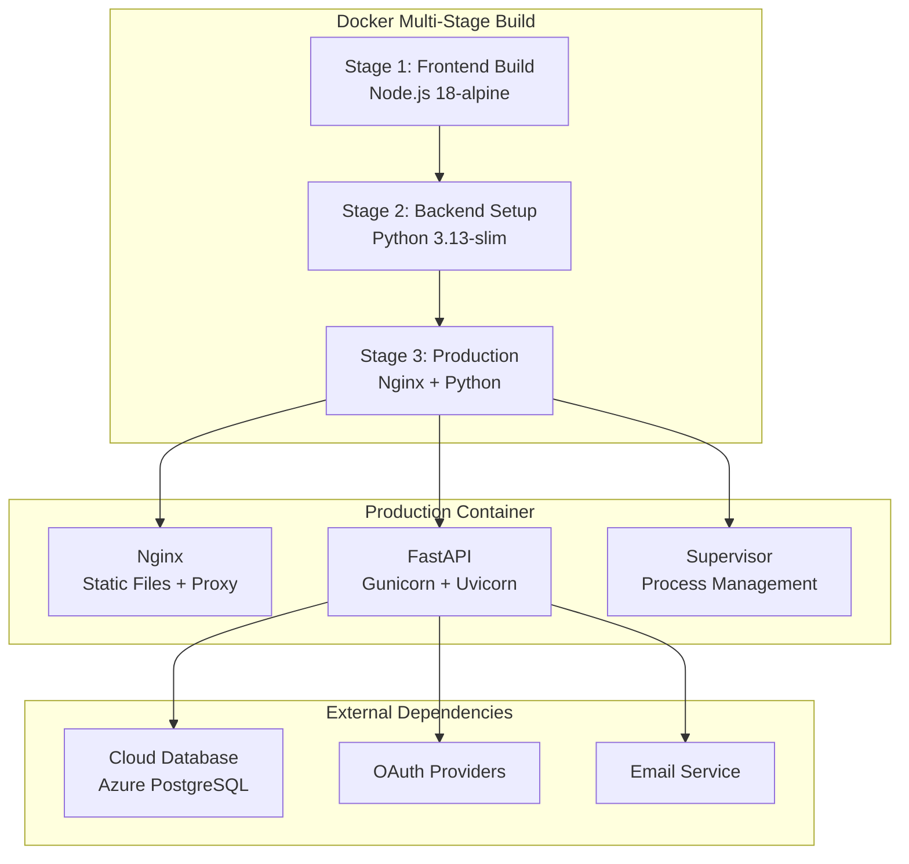

# BlueBank Architecture Documentation

## Overview

BlueBank is a modern, full-stack banking application built with a microservices-inspired architecture using FastAPI for the backend, Next.js for the frontend, and PostgreSQL for data persistence. The application is containerized with Docker and designed for cloud deployment with horizontal scaling capabilities.

## System Architecture



## Component Architecture

### Frontend Architecture (Next.js)



### Backend Architecture (FastAPI)



## Data Flow Architecture

### User Authentication Flow



### Banking Transaction Flow



## Key Design Patterns

### 1. Repository Pattern (Backend)
- **Models**: SQLAlchemy ORM models define database schema
- **Database Layer**: Centralized database connection and session management
- **Business Logic**: Separated from data access logic

### 2. Component-Based Architecture (Frontend)
- **Reusable Components**: AnimatedDigit, CounterScroller for UI consistency
- **Context API**: DarkModeContext for global state management
- **Page-Based Routing**: Next.js App Router for navigation

### 3. Middleware Pattern
- **CORS Middleware**: Cross-origin request handling
- **Authentication Middleware**: JWT token validation
- **Error Handling**: Centralized exception handling

### 4. Observer Pattern (Frontend)
- **Storage Events**: Cross-tab communication for balance updates
- **Polling System**: Regular API calls for real-time data
- **State Management**: React hooks for component state

## Security Architecture

### Authentication & Authorization



### Data Protection
- **Password Hashing**: bcrypt with salt
- **JWT Tokens**: Secure token-based authentication
- **HTTPS Encryption**: TLS 1.3 for data in transit
- **Input Validation**: Pydantic schemas for request validation
- **SQL Injection Prevention**: SQLAlchemy ORM with parameterized queries

## Database Schema

### Core Entities



## Deployment Architecture

### Containerization Strategy



### Cloud Deployment Options

1. **AWS Lightsail**: Simple VPS deployment
2. **Azure Container Instances**: Serverless containers
3. **Docker Hub**: Container registry
4. **AWS RDS / Azure PostgreSQL**: Managed database

## Performance Considerations

### Frontend Optimizations
- **Code Splitting**: Next.js automatic code splitting
- **Image Optimization**: Next.js Image component
- **Static Generation**: Pre-built pages where possible
- **Client-Side Caching**: localStorage for user data
- **Debounced API Calls**: Prevent excessive requests

### Backend Optimizations
- **Database Connection Pooling**: SQLAlchemy connection pool
- **Async Operations**: FastAPI async/await support
- **Response Caching**: HTTP caching headers
- **Database Indexing**: Optimized queries with indexes
- **Pagination**: Large dataset handling

### Real-Time Features
- **Polling Strategy**: 3-second intervals for balance updates
- **Event-Driven Updates**: Storage events for cross-tab sync
- **Optimistic UI**: Immediate UI updates before server confirmation

## Monitoring & Logging

### Application Logging
```python
# Backend logging configuration
import logging
logging.basicConfig(
    level=logging.INFO,
    format='%(asctime)s - %(name)s - %(levelname)s - %(message)s'
)
```

### Key Metrics to Monitor
- **Response Times**: API endpoint performance
- **Error Rates**: 4xx/5xx HTTP responses
- **Database Performance**: Query execution times
- **User Activity**: Login/transaction patterns
- **Resource Usage**: CPU/Memory utilization

## Scalability Considerations

### Horizontal Scaling
- **Stateless Design**: No server-side sessions
- **Database Scaling**: Read replicas for heavy read operations
- **Load Balancing**: Multiple container instances
- **CDN Integration**: Static asset delivery

### Vertical Scaling
- **Resource Optimization**: Container resource limits
- **Database Tuning**: Connection pool sizing
- **Caching Strategy**: Redis for session storage (future)

## Future Enhancements

### Technical Improvements
1. **Microservices**: Split into dedicated services (Auth, Banking, Notifications)
2. **Message Queue**: Redis/RabbitMQ for async processing
3. **WebSocket**: Real-time notifications without polling
4. **API Gateway**: Centralized API management
5. **Monitoring**: Prometheus + Grafana integration

### Feature Enhancements
1. **Mobile App**: React Native implementation
2. **Advanced Analytics**: Transaction insights and reporting
3. **Multi-Currency**: International banking support
4. **Loan System**: Credit and loan management
5. **Investment Platform**: Stock/crypto trading integration

## Conclusion

BlueBank's architecture is designed for scalability, maintainability, and security. The separation of concerns between frontend and backend, combined with modern containerization and cloud deployment strategies, provides a solid foundation for a production banking application.

The use of industry-standard technologies (FastAPI, Next.js, PostgreSQL) ensures long-term maintainability and developer familiarity. The security-first approach with OAuth integration, JWT tokens, and input validation provides the necessary protection for financial data.

The real-time features and responsive design create an excellent user experience, while the modular architecture allows for easy feature additions and scaling as the application grows.