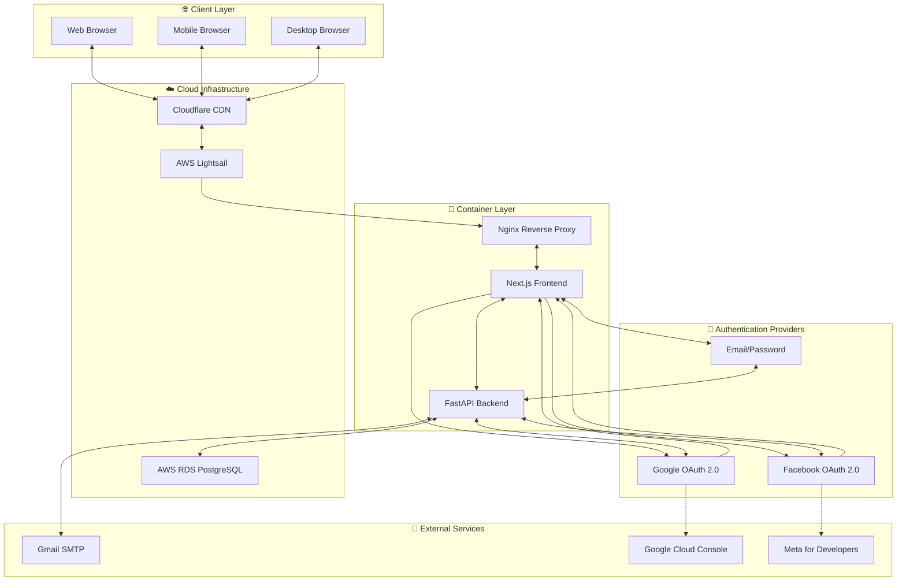
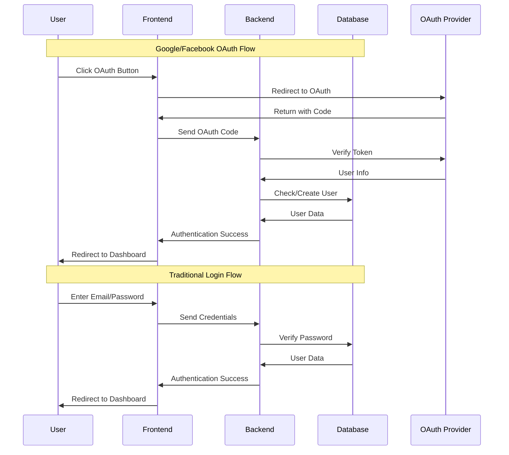
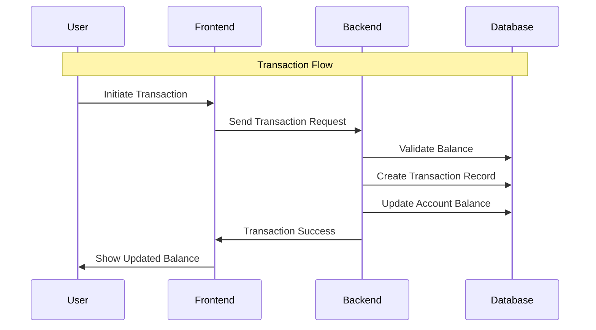
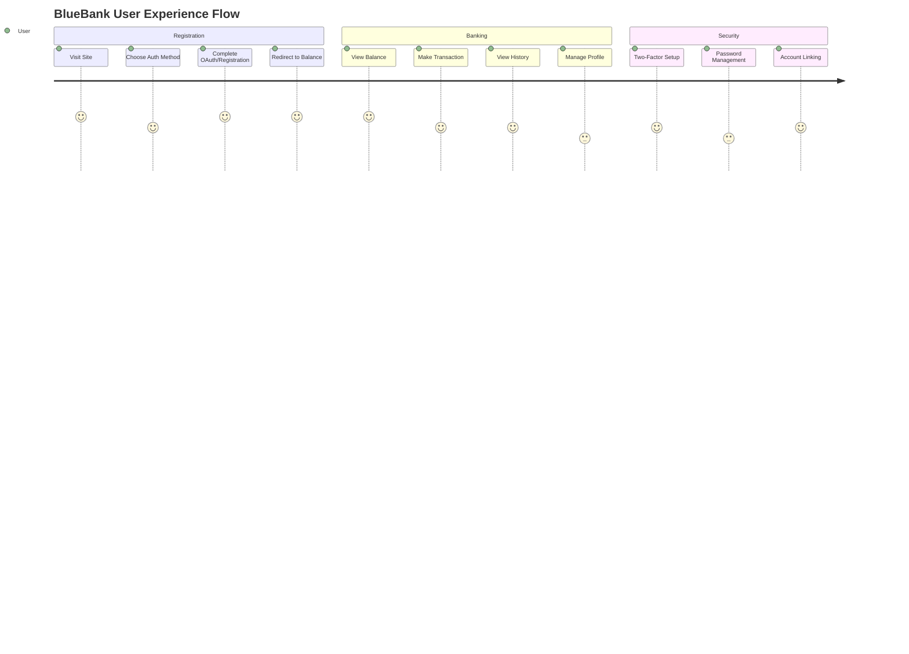

# 🏦 BlueBank Project - System Architecture

## 📊 **High-Level System Overview**



## 🏗️ **Detailed Component Architecture**

### **Frontend Layer (Next.js)**
```
┌─────────────────────────────────────────────────────────────┐
│                    Frontend (Next.js)                       │
├─────────────────────────────────────────────────────────────┤
│  📱 Pages:                                                  │
│  ├── /login          - Authentication                       │
│  ├── /register       - User Registration                    │
│  ├── /oauth-callback - OAuth Redirect Handler              │
│  ├── /balance        - Account Dashboard                    │
│  ├── /deposit        - Money Deposit                        │
│  ├── /withdraw       - Money Withdrawal                     │
│  ├── /transfer       - Money Transfer                       │
│  ├── /history        - Transaction History                  │
│  └── /profile        - User Profile Management              │
│                                                             │
│  🎣 Custom Hooks:                                           │
│  ├── useGoogleAuth   - Google OAuth Integration             │
│  ├── useFacebookAuth - Facebook OAuth Integration           │
│  └── useDarkMode     - Theme Management                     │
│                                                             │
│  🎨 UI Components:                                         │
│  ├── AnimatedDigit   - Balance Animation                    │
│  ├── CounterScroller - Number Scrolling Effect              │
│  └── DarkModeContext - Theme Context Provider               │
└─────────────────────────────────────────────────────────────┘
```

### **Backend Layer (FastAPI)**
```
┌─────────────────────────────────────────────────────────────┐
│                    Backend (FastAPI)                       │
├─────────────────────────────────────────────────────────────┤
│  🔌 API Endpoints:                                         │
│  ├── /api/auth/google      - Google OAuth Handler          │
│  ├── /api/auth/facebook    - Facebook OAuth Handler        │
│  ├── /auth/google/config   - Google OAuth Configuration    │
│  ├── /auth/facebook/config - Facebook OAuth Configuration  │
│  ├── /api/login            - Traditional Login             │
│  ├── /api/register         - User Registration             │
│  ├── /api/profile          - User Profile Management       │
│  ├── /api/setup-password   - Setup Password for OAuth      │
│  ├── /api/change-password  - Change User Password          │
│  ├── /api/balance          - Account Balance               │
│  ├── /api/deposit          - Money Deposit                 │
│  ├── /api/withdraw         - Money Withdrawal              │
│  ├── /api/transfer         - Money Transfer                │
│  └── /api/transactions     - Transaction History           │
│                                                            │
│  🗄️ Core Services:                                         │
│  ├── Authentication        - OAuth + Password Auth         │
│  ├── User Management      - CRUD Operations                │
│  ├── Banking Operations   - Financial Transactions         │
│  ├── Email Service        - SMTP via Gmail                 │
│  └── Security             - Password Hashing, JWT          │
└─────────────────────────────────────────────────────────────┘
```

### **Database Layer (PostgreSQL)**
```
┌─────────────────────────────────────────────────────────────┐
│                Database Schema (PostgreSQL)                 │
├─────────────────────────────────────────────────────────────┤
│  👥 Users Table:                                            │
│  ├── id (Primary Key)                                      │
│  ├── username (Unique)                                     │
│  ├── email (Unique)                                        │
│  ├── hashed_password                                       │
│  ├── display_name                                          │
│  ├── auth_provider         - email/google/facebook         │
│  ├── oauth_id             - OAuth Provider User ID        │
│  ├── is_active                                            │
│  └── is_admin                                             │
│                                                            │
│  💰 Accounts Table:                                        │
│  ├── id (Primary Key)                                      │
│  ├── user_id (Foreign Key)                                 │
│  ├── balance                                               │
│  └── account_type                                         │
│                                                             │
│  💸 Transactions Table:                                    │
│  ├── id (Primary Key)                                      │
│  ├── from_account_id                                       │
│  ├── to_account_id                                         │
│  ├── amount                                                │
│  ├── transaction_type      - deposit/withdraw/transfer     │
│  ├── timestamp                                             │
│  └── status                                               │
│                                                             │
│  🔑 Recovery Codes Table:                                  │
│  ├── id (Primary Key)                                      │
│  ├── user_id (Foreign Key)                                 │
│  ├── code_hash                                            │
│  └── expires_at                                           │
└─────────────────────────────────────────────────────────────┘
```

## 🔄 **Data Flow Architecture**

### **Authentication Flow**


### **Banking Operations Flow**


## 🐳 **Container Architecture**

### **Docker Container Structure**
```
┌─────────────────────────────────────────────────────────────┐
│                Docker Container (Port 80)                   │
├─────────────────────────────────────────────────────────────┤
│  🚀 Supervisor (Process Manager)                           │
│  ├── Backend Service    - FastAPI on Port 8000            │
│  ├── Frontend Service   - Next.js on Port 3000            │
│  └── Nginx Service      - Reverse Proxy on Port 80        │
│                                                             │
│  🌐 Nginx Configuration:                                    │
│  ├── /api/* → Backend (Port 8000)                         │
│  ├── /* → Frontend (Port 3000)                            │
│  └── Static Files → Frontend Build                         │
│                                                             │
│  🔧 Environment Variables:                                  │
│  ├── DATABASE_URL         - PostgreSQL Connection          │
│  ├── GOOGLE_CLIENT_ID     - OAuth Configuration            │
│  ├── FACEBOOK_APP_ID      - OAuth Configuration            │
│  ├── GMAIL_EMAIL          - SMTP Configuration             │
│  └── ENVIRONMENT          - dev/production                  │
└─────────────────────────────────────────────────────────────┘
```

## 🌍 **Deployment Architecture**

### **Production Environment**
```
┌─────────────────────────────────────────────────────────────┐
│                    Production Stack                         │
├─────────────────────────────────────────────────────────────┤
│  🌐 Domain: bluebank.unifra.org                            │
│                                                             │
│  🛡️ Cloudflare:                                            │
│  ├── CDN & Caching                                         │
│  ├── SSL/TLS Termination                                   │
│  ├── DDoS Protection                                       │
│  └── Global Edge Network                                   │
│                                                             │
│  ☁️ AWS Lightsail:                                         │
│  ├── Virtual Private Server                                │
│  ├── Docker Container                                      │
│  ├── Port 80 (HTTP)                                        │
│  └── Firewall Rules                                        │
│                                                             │
│  🗄️ AWS RDS:                                               │
│  ├── PostgreSQL Database                                   │
│  ├── Automated Backups                                     │
│  ├── Multi-AZ Deployment                                   │
│  └── Security Groups                                       │
└─────────────────────────────────────────────────────────────┘
```

### **Development Environment**
```
┌─────────────────────────────────────────────────────────────┐
│                   Development Stack                         │
├─────────────────────────────────────────────────────────────┤
│  💻 Local Development:                                     │
│  ├── Frontend: npm run dev (Port 3000)                    │
│  ├── Backend: uvicorn main:app --reload (Port 8000)       │
│  └── Database: Local SQLite (Optional)                     │
│                                                             │
│  🐳 Docker Development:                                    │
│  ├── docker-compose.dev.yml                                │
│  ├── Frontend: Port 3000                                   │
│  ├── Backend: Port 8000                                    │
│  └── Nginx: Port 8080                                      │
└─────────────────────────────────────────────────────────────┘
```

## 🔐 **Security Architecture**

### **Authentication & Authorization**
```
┌─────────────────────────────────────────────────────────────┐
│                Security Layers                              │
├─────────────────────────────────────────────────────────────┤
│  🛡️ OAuth 2.0 Security:                                   │
│  ├── Google OAuth          - Verified by Google            │
│  ├── Facebook OAuth        - Verified by Meta              │
│  └── State Validation      - CSRF Protection               │
│                                                             │
│  🔐 Password Security:                                     │
│  ├── bcrypt Hashing        - Salt + Hash                   │
│  ├── Session Management    - sessionStorage                 │
│  └── Password Validation   - Strength Requirements         │
│                                                             │
│  🌐 Network Security:                                       │
│  ├── HTTPS Only            - TLS 1.3                       │
│  ├── CORS Configuration    - Origin Validation             │
│  ├── Rate Limiting         - API Protection                │
│  └── Input Validation      - SQL Injection Prevention      │
└─────────────────────────────────────────────────────────────┘
```

## 📱 **User Experience Flow**

### **Complete User Journey**


## 🚀 **Scalability Considerations**

### **Horizontal Scaling Strategy**
```
┌─────────────────────────────────────────────────────────────┐
│                Scalability Architecture                     │
├─────────────────────────────────────────────────────────────┤
│  📈 Load Balancer:                                         │
│  ├── Multiple Container Instances                          │
│  ├── Health Checks                                         │
│  └── Auto-scaling Groups                                   │
│                                                             │
│  🗄️ Database Scaling:                                      │
│  ├── Read Replicas                                         │
│  ├── Connection Pooling                                    │
│  └── Query Optimization                                    │
│                                                             │
│  🚀 Performance:                                            │
│  ├── Redis Caching                                         │
│  ├── CDN for Static Assets                                 │
│  └── API Response Caching                                  │
└─────────────────────────────────────────────────────────────┘
```

## 🔧 **Technology Stack Summary**

| Layer | Technology | Version | Purpose |
|-------|------------|---------|---------|
| **Frontend** | Next.js | 14.x | React Framework with SSR |
| **Backend** | FastAPI | 0.104.x | Python API Framework |
| **Database** | PostgreSQL | 15.x | Primary Database |
| **Container** | Docker | 24.x | Application Containerization |
| **Proxy** | Nginx | 1.26.x | Reverse Proxy & Load Balancer |
| **Process Manager** | Supervisor | 4.x | Service Management |
| **Authentication** | OAuth 2.0 | - | Google & Facebook Integration |
| **Deployment** | AWS Lightsail | - | Cloud Infrastructure |
| **CDN** | Cloudflare | - | Content Delivery & Security |
| **Email** | Gmail SMTP | - | Transaction Notifications |

## 📋 **API Endpoints Summary**

| Method | Endpoint | Description | Authentication |
|--------|----------|-------------|----------------|
| `POST` | `/api/register` | User Registration | None |
| `POST` | `/api/login` | User Login | None |
| `POST` | `/api/auth/google` | Google OAuth | Google Token |
| `POST` | `/api/auth/facebook` | Facebook OAuth | Facebook Token |
| `GET` | `/auth/google/config` | Google OAuth Config | None |
| `GET` | `/auth/facebook/config` | Facebook OAuth Config | None |
| `POST` | `/api/profile` | User Profile | Email + Password |
| `POST` | `/api/setup-password` | Setup Password for OAuth | Email + Password |
| `POST` | `/api/change-password` | Change User Password | Email + Password |
| `POST` | `/api/balance` | Account Balance | Email + Password |
| `POST` | `/api/deposit` | Money Deposit | Email + Password |
| `POST` | `/api/withdraw` | Money Withdrawal | Email + Password |
| `POST` | `/api/transfer` | Money Transfer | Email + Password |
| `POST` | `/api/transactions` | Transaction History | Email + Password |

---

*This architecture diagram represents the current state of the BlueBank project as of the latest deployment.*