# BlueBank Project Internal Connections - Diagram Code

## Copy this code to use in Mermaid Live Editor (https://mermaid.live/)

```mermaid
graph TB
    %% User Interaction Layer
    subgraph "👤 User Interaction"
        USER[User Browser]
    end

    %% Frontend Layer
    subgraph "⚛️ Frontend (Next.js)"
        subgraph "📄 Pages"
            LOGIN[login/page.tsx]
            REGISTER[register/page.tsx]
            BALANCE[balance/page.tsx]
            DEPOSIT[deposit/page.tsx]
            WITHDRAW[withdraw/page.tsx]
            TRANSFER[transfer/page.tsx]
            HISTORY[history/page.tsx]
            PROFILE[profile/page.tsx]
            OAUTH_CALLBACK[oauth-callback/page.tsx]
        end
        
        subgraph "🛠️ Utilities"
            API_CLIENT[apiClient.ts]
            SESSION_MGR[sessionManager.ts]
            SESSION_RECOVERY[sessionRecovery.ts]
        end
        
        subgraph "🎣 Hooks"
            GOOGLE_AUTH[useGoogleAuth.ts]
            FACEBOOK_AUTH[useFacebookAuth.ts]
        end
        
        subgraph "🧩 Components"
            ANIMATED_DIGIT[AnimatedDigit.tsx]
            DIGIT_SCROLLER[DigitScroller.tsx]
            COUNTER_SCROLLER[CounterScroller.tsx]
        end
        
        subgraph "🎭 Contexts"
            DARK_MODE[DarkModeContext.tsx]
        end
        
        subgraph "📁 Core Files"
            LAYOUT[layout.js]
            GLOBALS[globals.css]
            NEXT_CONFIG[next.config.mjs]
            PACKAGE_JSON[package.json]
        end
    end

    %% Infrastructure Layer
    subgraph "🌐 Infrastructure"
        NGINX[nginx.conf]
        DOCKER_COMPOSE[docker-compose.yml]
        SUPERVISOR[supervisord.conf]
    end

    %% Backend Layer
    subgraph "🐍 Backend (FastAPI)"
        subgraph "🎯 Main Application"
            MAIN_PY[main.py]
        end
        
        subgraph "🗄️ Database Layer"
            DATABASE[database.py]
            MODELS[models.py]
            SCHEMAS[schemas.py]
        end
        
        subgraph "🔐 Authentication"
            AUTH[auth.py]
        end
        
        subgraph "⚙️ Configuration"
            REQUIREMENTS[requirements.txt]
            BACKEND_ENV[.env]
            LOGGING[logging_config.py]
        end
        
        subgraph "🛠️ Utilities"
            CLEAR_DB[clear_database.py]
        end
    end

    %% Database Layer
    subgraph "🗄️ Database"
        POSTGRES[(PostgreSQL)]
    end

    %% External Services
    subgraph "🌍 External Services"
        GOOGLE_OAUTH[Google OAuth]
        FACEBOOK_OAUTH[Facebook OAuth]
        EMAIL_SVC[Email Service]
    end

    %% User Interaction Flow
    USER --> LOGIN
    USER --> REGISTER
    USER --> BALANCE
    USER --> DEPOSIT
    USER --> WITHDRAW
    USER --> TRANSFER
    USER --> HISTORY
    USER --> PROFILE

    %% Frontend Internal Connections
    LOGIN --> GOOGLE_AUTH
    LOGIN --> FACEBOOK_AUTH
    LOGIN --> API_CLIENT
    REGISTER --> API_CLIENT
    OAUTH_CALLBACK --> GOOGLE_AUTH
    OAUTH_CALLBACK --> FACEBOOK_AUTH
    OAUTH_CALLBACK --> SESSION_RECOVERY
    
    BALANCE --> SESSION_MGR
    BALANCE --> API_CLIENT
    BALANCE --> ANIMATED_DIGIT
    BALANCE --> DIGIT_SCROLLER
    BALANCE --> COUNTER_SCROLLER
    
    DEPOSIT --> SESSION_MGR
    DEPOSIT --> API_CLIENT
    WITHDRAW --> SESSION_MGR
    WITHDRAW --> API_CLIENT
    TRANSFER --> SESSION_MGR
    TRANSFER --> API_CLIENT
    HISTORY --> API_CLIENT
    PROFILE --> API_CLIENT

    %% Utility Dependencies
    SESSION_MGR --> SESSION_RECOVERY
    API_CLIENT --> SESSION_RECOVERY
    GOOGLE_AUTH --> API_CLIENT
    FACEBOOK_AUTH --> API_CLIENT

    %% Component Dependencies
    ANIMATED_DIGIT --> DIGIT_SCROLLER
    DIGIT_SCROLLER --> COUNTER_SCROLLER

    %% Layout Dependencies
    LAYOUT --> GLOBALS
    LAYOUT --> DARK_MODE
    LOGIN --> LAYOUT
    REGISTER --> LAYOUT
    BALANCE --> LAYOUT
    DEPOSIT --> LAYOUT
    WITHDRAW --> LAYOUT
    TRANSFER --> LAYOUT
    HISTORY --> LAYOUT
    PROFILE --> LAYOUT

    %% Infrastructure Connections
    NGINX --> MAIN_PY
    NGINX --> PACKAGE_JSON
    DOCKER_COMPOSE --> MAIN_PY
    DOCKER_COMPOSE --> PACKAGE_JSON
    SUPERVISOR --> MAIN_PY
    SUPERVISOR --> PACKAGE_JSON

    %% Backend Internal Connections
    MAIN_PY --> DATABASE
    MAIN_PY --> MODELS
    MAIN_PY --> SCHEMAS
    MAIN_PY --> AUTH
    MAIN_PY --> REQUIREMENTS
    MAIN_PY --> BACKEND_ENV
    MAIN_PY --> LOGGING
    MAIN_PY --> CLEAR_DB

    DATABASE --> MODELS
    AUTH --> DATABASE
    CLEAR_DB --> DATABASE

    %% Database Connections
    DATABASE --> POSTGRES
    MAIN_PY --> POSTGRES

    %% External Service Connections
    MAIN_PY --> GOOGLE_OAUTH
    MAIN_PY --> FACEBOOK_OAUTH
    MAIN_PY --> EMAIL_SVC
    GOOGLE_AUTH --> GOOGLE_OAUTH
    FACEBOOK_AUTH --> FACEBOOK_OAUTH

    %% Frontend-Backend Communication
    API_CLIENT --> NGINX
    NGINX --> MAIN_PY

    %% Styling with black text
    classDef userLayer fill:#e3f2fd,color:#000000
    classDef frontendLayer fill:#e8f5e8,color:#000000
    classDef infrastructureLayer fill:#fff3e0,color:#000000
    classDef backendLayer fill:#f3e5f5,color:#000000
    classDef databaseLayer fill:#fce4ec,color:#000000
    classDef externalLayer fill:#ffebee,color:#000000

    class USER userLayer
    class LOGIN,REGISTER,BALANCE,DEPOSIT,WITHDRAW,TRANSFER,HISTORY,PROFILE,OAUTH_CALLBACK,API_CLIENT,SESSION_MGR,SESSION_RECOVERY,GOOGLE_AUTH,FACEBOOK_AUTH,ANIMATED_DIGIT,DIGIT_SCROLLER,COUNTER_SCROLLER,DARK_MODE,LAYOUT,GLOBALS,NEXT_CONFIG,PACKAGE_JSON frontendLayer
    class NGINX,DOCKER_COMPOSE,SUPERVISOR infrastructureLayer
    class MAIN_PY,DATABASE,MODELS,SCHEMAS,AUTH,REQUIREMENTS,BACKEND_ENV,LOGGING,CLEAR_DB backendLayer
    class POSTGRES databaseLayer
    class GOOGLE_OAUTH,FACEBOOK_OAUTH,EMAIL_SVC externalLayer
```

## Instructions:
1. Copy the code above
2. Go to https://mermaid.live/
3. Paste it in the editor
4. Export as PNG, SVG, or PDF