# 🔗 **BlueBank Project - File Connections & Dependencies**

## 📊 **Complete File Relationship Diagram**

```mermaid
graph TB
    %% Root Level Configuration
    subgraph "🏠 Root Configuration"
        ROOT_PKG[package.json]
        ROOT_DOCKER[Dockerfile]
        NGINX[nginx.conf]
        SUPERVISOR[supervisord.conf]
        GITIGNORE[.gitignore]
    end

    %% Documentation
    subgraph "📚 Documentation"
        README[README.md]
        ARCH_DOC[ARCHITECTURE.md]
        PROJECT_PLAN[PROJECT_PLAN.md]
        SECURITY[SECURITY_ENHANCEMENTS.md]
        PROBLEMS[PROBLEM_DOCUMENTATION.md]
    end

    %% Deployment Scripts
    subgraph "🚀 Deployment Scripts"
        DEPLOY_SIMPLE[deploy-simple.sh]
        DEPLOY_SCRIPT[deploy-script.sh]
        DEPLOY_LIGHTSAIL[deploy-to-lightsail.ps1/.sh]
        START_SH[start.sh]
    end

    %% Backend Core
    subgraph "🐍 Backend Core"
        MAIN_PY[main.py]
        MODELS[models.py]
        SCHEMAS[schemas.py]
        DATABASE[database.py]
        AUTH[auth.py]
        REQUIREMENTS[requirements.txt]
        BACKEND_DOCKER[Dockerfile]
        BACKEND_ENV[.env]
    end

    %% Backend Utilities
    subgraph "🔧 Backend Utilities"
        CLEAR_DB[clear_database.py]
        LOGGING[logging_config.py]
        APP_LOG[app.log]
    end

    %% Frontend Core
    subgraph "⚛️ Frontend Core"
        FRONTEND_PKG[package.json]
        NEXT_CONFIG[next.config.mjs]
        TS_CONFIG[tsconfig.json]
        FRONTEND_DOCKER[Dockerfile]
        FRONTEND_ENV[.env]
    end

    %% Frontend Pages
    subgraph "📄 Frontend Pages"
        LAYOUT[layout.js]
        GLOBALS[globals.css]
        HOME[page.js]
        
        subgraph "🔐 Authentication Pages"
            LOGIN[login/page.tsx]
            REGISTER[register/page.tsx]
            FORGOT_PWD[forgot-password/page.tsx]
            RESET_PWD[reset-password/page.tsx]
            OAUTH_CALLBACK[oauth-callback/page.tsx]
        end
        
        subgraph "💰 Banking Pages"
            BALANCE[balance/page.tsx]
            DEPOSIT[deposit/page.tsx]
            WITHDRAW[withdraw/page.tsx]
            TRANSFER[transfer/page.tsx]
            HISTORY[history/page.tsx]
            PROFILE[profile/page.tsx]
        end
    end

    %% Frontend Utilities
    subgraph "🛠️ Frontend Utilities"
        SESSION_MGR[sessionManager.ts]
        API_CLIENT[apiClient.ts]
        SESSION_RECOVERY[sessionRecovery.ts]
    end

    %% Frontend Hooks
    subgraph "🎣 Frontend Hooks"
        GOOGLE_AUTH[useGoogleAuth.ts]
        FACEBOOK_AUTH[useFacebookAuth.ts]
    end

    %% Frontend Components
    subgraph "🧩 Frontend Components"
        ANIMATED_DIGIT[AnimatedDigit.tsx]
        DIGIT_SCROLLER[DigitScroller.tsx]
        COUNTER_SCROLLER[CounterScroller.tsx]
        ANIMATED_CSS[animatedDigit.css]
    end

    %% Frontend Contexts
    subgraph "🎭 Frontend Contexts"
        DARK_MODE[DarkModeContext.tsx]
    end

    %% Frontend Assets
    subgraph "🖼️ Frontend Assets"
        LOGO[bluebank-logo.png]
        FAVICON[favicon.ico]
    end

    %% Docker Configuration
    subgraph "🐳 Docker Configuration"
        DOCKER_COMPOSE[docker-compose.yml]
        DOCKER_DEV[docker-compose.dev.yml]
    end

    %% Scripts
    subgraph "📜 Scripts"
        SETUP_PS[setup.ps1]
        SETUP_SH[setup.sh]
        START_DEV[start-dev.bat]
        START_BAT[start.bat]
        DEPLOY_AWS[deploy-aws.ps1/.sh]
    end

    %% Documentation
    subgraph "📖 Documentation"
        ARCH_DIAGRAM[ARCHITECTURE_DIAGRAM.md]
        GOOGLE_OAUTH[GOOGLE_OAUTH_SETUP.md]
        FACEBOOK_OAUTH[FACEBOOK_OAUTH_SETUP.md]
        AWS_DEPLOY[AWS_DEPLOYMENT.md]
        DEPLOYMENT[DEPLOYMENT.md]
        QUICK_START[QUICK_START.md]
    end

    %% External Services
    subgraph "🌐 External Services"
        GOOGLE_OAUTH_SVC[Google OAuth]
        FACEBOOK_OAUTH_SVC[Facebook OAuth]
        DATABASE[(PostgreSQL DB)]
        EMAIL_SVC[Email Service]
    end

    %% Connection Lines - Root Dependencies
    ROOT_PKG --> FRONTEND_PKG
    ROOT_DOCKER --> DOCKER_COMPOSE
    NGINX --> MAIN_PY
    NGINX --> FRONTEND_PKG
    SUPERVISOR --> MAIN_PY
    SUPERVISOR --> FRONTEND_PKG

    %% Backend Internal Dependencies
    MAIN_PY --> MODELS
    MAIN_PY --> SCHEMAS
    MAIN_PY --> DATABASE
    MAIN_PY --> AUTH
    MAIN_PY --> REQUIREMENTS
    MAIN_PY --> BACKEND_ENV
    MAIN_PY --> LOGGING
    MAIN_PY --> APP_LOG
    BACKEND_DOCKER --> MAIN_PY
    BACKEND_DOCKER --> REQUIREMENTS

    %% Frontend Internal Dependencies
    FRONTEND_PKG --> NEXT_CONFIG
    FRONTEND_PKG --> TS_CONFIG
    FRONTEND_PKG --> FRONTEND_DOCKER
    FRONTEND_PKG --> FRONTEND_ENV

    %% Page Dependencies
    LAYOUT --> GLOBALS
    LAYOUT --> DARK_MODE
    LAYOUT --> FAVICON
    HOME --> LAYOUT
    
    %% Authentication Page Dependencies
    LOGIN --> GOOGLE_AUTH
    LOGIN --> FACEBOOK_AUTH
    LOGIN --> API_CLIENT
    REGISTER --> API_CLIENT
    FORGOT_PWD --> API_CLIENT
    RESET_PWD --> API_CLIENT
    OAUTH_CALLBACK --> GOOGLE_AUTH
    OAUTH_CALLBACK --> FACEBOOK_AUTH
    OAUTH_CALLBACK --> SESSION_RECOVERY

    %% Banking Page Dependencies
    BALANCE --> SESSION_MGR
    BALANCE --> API_CLIENT
    BALANCE --> ANIMATED_DIGIT
    BALANCE --> DIGIT_SCROLLER
    BALANCE --> COUNTER_SCROLLER
    BALANCE --> ANIMATED_CSS
    DEPOSIT --> SESSION_MGR
    DEPOSIT --> API_CLIENT
    WITHDRAW --> SESSION_MGR
    WITHDRAW --> API_CLIENT
    TRANSFER --> SESSION_MGR
    TRANSFER --> API_CLIENT
    HISTORY --> API_CLIENT
    PROFILE --> API_CLIENT

    %% Utility Dependencies
    SESSION_MGR --> SESSION_RECOVERY
    API_CLIENT --> SESSION_RECOVERY
    GOOGLE_AUTH --> API_CLIENT
    FACEBOOK_AUTH --> API_CLIENT

    %% Component Dependencies
    ANIMATED_DIGIT --> ANIMATED_CSS
    DIGIT_SCROLLER --> ANIMATED_CSS
    COUNTER_SCROLLER --> ANIMATED_CSS

    %% Asset Dependencies
    LAYOUT --> LOGO
    LAYOUT --> FAVICON

    %% Docker Dependencies
    DOCKER_COMPOSE --> BACKEND_DOCKER
    DOCKER_COMPOSE --> FRONTEND_DOCKER
    DOCKER_DEV --> BACKEND_DOCKER
    DOCKER_DEV --> FRONTEND_DOCKER

    %% Script Dependencies
    SETUP_PS --> REQUIREMENTS
    SETUP_SH --> REQUIREMENTS
    START_DEV --> FRONTEND_PKG
    START_BAT --> FRONTEND_PKG
    DEPLOY_AWS --> DOCKER_COMPOSE

    %% External Service Connections
    MAIN_PY --> DATABASE
    MAIN_PY --> GOOGLE_OAUTH_SVC
    MAIN_PY --> FACEBOOK_OAUTH_SVC
    MAIN_PY --> EMAIL_SVC
    GOOGLE_AUTH --> GOOGLE_OAUTH_SVC
    FACEBOOK_AUTH --> FACEBOOK_OAUTH_SVC

    %% Documentation Dependencies
    ARCH_DIAGRAM --> README
    GOOGLE_OAUTH --> README
    FACEBOOK_OAUTH --> README
    AWS_DEPLOY --> README
    DEPLOYMENT --> README
    QUICK_START --> README

    %% Styling
    classDef rootConfig fill:#e1f5fe
    classDef backend fill:#f3e5f5
    classDef frontend fill:#e8f5e8
    classDef docker fill:#fff3e0
    classDef scripts fill:#fce4ec
    classDef docs fill:#f1f8e9
    classDef external fill:#ffebee

    class ROOT_PKG,ROOT_DOCKER,NGINX,SUPERVISOR,GITIGNORE rootConfig
    class MAIN_PY,MODELS,SCHEMAS,DATABASE,AUTH,REQUIREMENTS,BACKEND_DOCKER,BACKEND_ENV,CLEAR_DB,LOGGING,APP_LOG backend
    class FRONTEND_PKG,NEXT_CONFIG,TS_CONFIG,FRONTEND_DOCKER,FRONTEND_ENV,LAYOUT,GLOBALS,HOME,LOGIN,REGISTER,FORGOT_PWD,RESET_PWD,OAUTH_CALLBACK,BALANCE,DEPOSIT,WITHDRAW,TRANSFER,HISTORY,PROFILE,SESSION_MGR,API_CLIENT,SESSION_RECOVERY,GOOGLE_AUTH,FACEBOOK_AUTH,ANIMATED_DIGIT,DIGIT_SCROLLER,COUNTER_SCROLLER,ANIMATED_CSS,DARK_MODE,LOGO,FAVICON frontend
    class DOCKER_COMPOSE,DOCKER_DEV docker
    class SETUP_PS,SETUP_SH,START_DEV,START_BAT,DEPLOY_AWS scripts
    class README,ARCH_DOC,PROJECT_PLAN,SECURITY,PROBLEMS,ARCH_DIAGRAM,GOOGLE_OAUTH,FACEBOOK_OAUTH,AWS_DEPLOY,DEPLOYMENT,QUICK_START docs
    class GOOGLE_OAUTH_SVC,FACEBOOK_OAUTH_SVC,DATABASE,EMAIL_SVC external
```



## 🔄 **Data Flow Connections**

### **1. User Authentication Flow:**
```
User Input → login/page.tsx → useGoogleAuth.ts → oauth-callback/page.tsx → 
sessionRecovery.ts → sessionManager.ts → balance/page.tsx
```

### **2. API Request Flow:**
```
Frontend Page → apiClient.ts → nginx.conf → backend/main.py → 
database.py → PostgreSQL → response back through same path
```

### **3. Session Management Flow:**
```
sessionManager.ts → sessionRecovery.ts → localStorage/sessionStorage → 
All authenticated pages (balance, deposit, transfer, withdraw)
```

### **4. Build & Deployment Flow:**
```
package.json → Dockerfile → docker-compose.yml → deploy-*.sh → AWS Lightsail
```

## 📋 **Key Dependency Groups**

### **Backend Dependencies:**
- **`main.py`** depends on: `models.py`, `schemas.py`, `database.py`, `auth.py`, `.env`
- **`database.py`** depends on: `models.py`, `.env`
- **`auth.py`** depends on: `database.py`

### **Frontend Dependencies:**
- **All pages** depend on: `sessionManager.ts`, `apiClient.ts`
- **Authentication pages** depend on: `useGoogleAuth.ts`, `useFacebookAuth.ts`
- **Banking pages** depend on: `AnimatedDigit.tsx`, `DigitScroller.tsx`
- **All pages** depend on: `layout.js`, `globals.css`

### **Infrastructure Dependencies:**
- **`nginx.conf`** routes traffic between frontend and backend
- **`docker-compose.yml`** orchestrates all containers
- **`supervisord.conf`** manages process lifecycle

### **Configuration Dependencies:**
- **`.env`** files contain secrets used by both frontend and backend
- **`package.json`** and **`requirements.txt`** define dependencies
- **`tsconfig.json`** and **`next.config.mjs`** configure build process

## 🎯 **Critical Connection Points**

### **1. API Gateway (`nginx.conf`):**
- Routes `/api/*` → Backend (`main.py`)
- Routes `/*` → Frontend (Next.js pages)

### **2. Session Bridge (`sessionManager.ts`):**
- Connects all authenticated pages
- Manages timeout across entire application
- Integrates with `sessionRecovery.ts` for persistence

### **3. OAuth Integration:**
- `useGoogleAuth.ts` → `oauth-callback/page.tsx` → `main.py` (Google OAuth endpoint)
- `useFacebookAuth.ts` → `oauth-callback/page.tsx` → `main.py` (Facebook OAuth endpoint)

### **4. Database Connection:**
- `main.py` → `database.py` → PostgreSQL database
- All financial operations flow through this path

This diagram shows how your entire application is interconnected, with clear separation of concerns while maintaining proper data flow between components. 