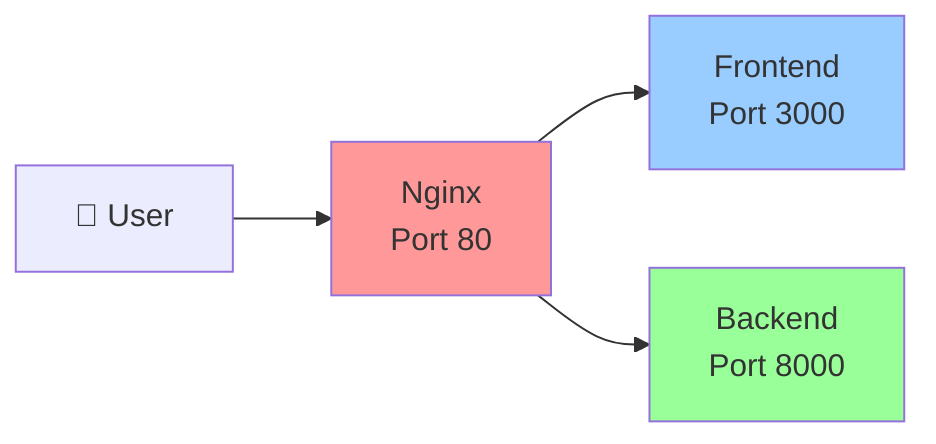

# 🌐 **What is Nginx?**

## 📖 **Definition & Purpose**

**Nginx** (pronounced "engine-x") is a powerful, high-performance **web server** and **reverse proxy** that acts as a **traffic director** for web applications. Think of it as a smart **doorman** that decides where incoming requests should go.

---

## 🏗️ **Nginx in Your Banking Project**

### **🎯 Primary Role:**
Nginx serves as a **reverse proxy** that sits between your users and your application servers, intelligently routing traffic to the right place.

### **📊 Your Current Nginx Configuration:**

```nginx
# Traffic Director Setup
upstream frontend {
    server localhost:3000;  # Next.js React app
}

upstream backend {
    server localhost:8000;  # FastAPI Python backend
}

# Smart Routing Rules
location /api/ {
    proxy_pass http://backend/;  # API calls → Backend
}

location / {
    proxy_pass http://frontend;  # Everything else → Frontend
}
```

---

## 🔄 **How Nginx Works in Your Project**

### **📡 Request Flow:**



### **🎯 Smart Routing Examples:**

| **User Request** | **Nginx Decision** | **Destination** |
|------------------|-------------------|-----------------|
| `https://bluebank.com/` | Frontend route | Next.js (Port 3000) |
| `https://bluebank.com/login` | Frontend route | Next.js (Port 3000) |
| `https://bluebank.com/api/auth/google` | API route | FastAPI (Port 8000) |
| `https://bluebank.com/api/balance` | API route | FastAPI (Port 8000) |
| `https://bluebank.com/transfer` | Frontend route | Next.js (Port 3000) |

---

## 🛡️ **Why Use Nginx?**

### **1. 🎯 Single Entry Point**
- **Before**: Users need to know different ports (3000 for frontend, 8000 for backend)
- **After**: Everything goes through one URL (`https://bluebank.com`)

### **2. 🔒 Security Enhancement**
- **Hide internal ports** from the internet
- **Add security headers** and SSL termination
- **Rate limiting** and DDoS protection

### **3. ⚡ Performance Optimization**
- **Load balancing** across multiple servers
- **Caching** static files (images, CSS, JS)
- **Compression** (gzip) for faster loading

### **4. 🔄 Load Balancing**
- **Distribute traffic** across multiple backend instances
- **Health checks** to remove failed servers
- **High availability** setup

---

## 🏢 **Production vs Development**

### **🖥️ Development (Your Current Setup):**
```nginx
# Simple routing to local services
upstream frontend { server localhost:3000; }
upstream backend { server localhost:8000; }
```

### **🚀 Production (AWS Lightsail):**
```nginx
# Multiple servers for high availability
upstream frontend {
    server frontend1:3000;
    server frontend2:3000;
    server frontend3:3000;
}

upstream backend {
    server backend1:8000;
    server backend2:8000;
    server backend3:8000;
}
```

---

## 🔧 **Key Nginx Features in Your Project**

### **1. 📍 URL-Based Routing**
```nginx
# API calls go to backend
location /api/ {
    proxy_pass http://backend/;
}

# Everything else goes to frontend
location / {
    proxy_pass http://frontend;
}
```

### **2. 🔍 Header Forwarding**
```nginx
proxy_set_header Host $host;
proxy_set_header X-Real-IP $remote_addr;
proxy_set_header X-Forwarded-For $proxy_add_x_forwarded_for;
proxy_set_header X-Forwarded-Proto $scheme;
```

### **3. ⚙️ Performance Settings**
```nginx
events {
    worker_connections 1024;  # Handle 1024 concurrent connections
}
```

---

## 🌍 **Real-World Example**

### **👤 User Journey:**

1. **User types**: `https://bluebank.com/balance`
2. **Nginx receives** the request on port 80
3. **Nginx checks**: "Does this URL start with `/api/`?"
4. **Nginx decides**: "No, this is a frontend route"
5. **Nginx forwards** to `localhost:3000` (Next.js)
6. **Next.js renders** the balance page
7. **Next.js makes API call** to `/api/balance`
8. **Nginx receives** the API call
9. **Nginx forwards** to `localhost:8000` (FastAPI)
10. **FastAPI returns** balance data
11. **User sees** their balance page

---

## 🎯 **Benefits for Your Banking App**

### **🔒 Security:**
- **Hide internal architecture** from users
- **Centralized SSL/TLS** management
- **Request filtering** and validation

### **⚡ Performance:**
- **Static file caching** (logos, CSS, JavaScript)
- **Request compression** for faster loading
- **Connection pooling** for better resource usage

### **🔄 Scalability:**
- **Easy to add more servers** without changing frontend/backend code
- **Load distribution** across multiple instances
- **Health monitoring** and automatic failover

### **🛠️ Maintenance:**
- **Single point of configuration** for routing rules
- **Easy SSL certificate management**
- **Centralized logging** and monitoring

---

## 📚 **Nginx vs Other Web Servers**

| **Feature** | **Nginx** | **Apache** | **IIS** |
|-------------|-----------|------------|---------|
| **Performance** | ⭐⭐⭐⭐⭐ | ⭐⭐⭐ | ⭐⭐⭐⭐ |
| **Memory Usage** | ⭐⭐⭐⭐⭐ | ⭐⭐⭐ | ⭐⭐⭐ |
| **Configuration** | ⭐⭐⭐⭐ | ⭐⭐⭐ | ⭐⭐ |
| **Reverse Proxy** | ⭐⭐⭐⭐⭐ | ⭐⭐⭐ | ⭐⭐⭐ |
| **Load Balancing** | ⭐⭐⭐⭐⭐ | ⭐⭐⭐ | ⭐⭐⭐⭐ |

---

## 🎯 **Summary**

**Nginx is your project's traffic director** that:

1. **🎯 Routes requests** to the right service (frontend vs backend)
2. **🔒 Provides security** by hiding internal architecture
3. **⚡ Optimizes performance** through caching and compression
4. **🔄 Enables scaling** by distributing load across servers
5. **🛠️ Simplifies deployment** with a single entry point

**In your banking app, Nginx ensures users have a seamless experience while your frontend and backend work together efficiently!** 🌐✨ 