# 🔐 **Backend OAuth Connection Architecture**

## 📊 **OAuth Flow Diagram**

```mermaid
sequenceDiagram
    participant U as 👤 User
    participant F as ⚛️ Frontend
    participant B as 🐍 Backend
    participant G as 🔍 Google OAuth
    participant FB as 📘 Facebook OAuth
    participant DB as 🗄️ Database

    %% Google OAuth Flow
    Note over U,DB: Google OAuth Flow
    U->>F: Click "Login with Google"
    F->>F: useGoogleAuth.ts initiates OAuth
    F->>G: Redirect to Google OAuth
    G->>U: Google login page
    U->>G: Enter credentials
    G->>F: Redirect with code/token
    F->>F: oauth-callback/page.tsx processes
    F->>B: POST /api/auth/google
    Note right of B: Backend receives either:<br/>- authorization code<br/>- ID token (credential)
    
    alt Authorization Code Flow
        B->>G: Exchange code for token
        G->>B: Return access token + user info
    else ID Token Flow
        B->>B: verify_google_token()
        Note right of B: Uses Google's id_token library<br/>Verifies token with GOOGLE_CLIENT_ID
    end
    
    B->>B: create_or_get_google_user()
    B->>DB: Check if user exists by email
    alt New User
        B->>DB: Create new user record
        B->>B: Send welcome email
    else Existing User
        B->>DB: Link Google account
        Note right of B: Account linking - user can<br/>sign in with Google OR original method
    end
    B->>F: Return user profile + access token
    F->>F: Store session data
    F->>U: Redirect to dashboard

    %% Facebook OAuth Flow
    Note over U,DB: Facebook OAuth Flow
    U->>F: Click "Login with Facebook"
    F->>F: useFacebookAuth.ts initiates OAuth
    F->>FB: Redirect to Facebook OAuth
    FB->>U: Facebook login page
    U->>FB: Enter credentials
    FB->>F: Redirect with access token
    F->>F: oauth-callback/page.tsx processes
    F->>B: POST /api/auth/facebook
    Note right of B: Backend receives access token
    
    B->>B: verify_facebook_token()
    B->>FB: GET /graph.facebook.com/me
    Note right of B: Verifies token and gets user info<br/>Checks app ID matches FACEBOOK_APP_ID
    FB->>B: Return user profile data
    
    B->>B: create_or_get_facebook_user()
    B->>DB: Check if user exists by email
    alt New User
        B->>DB: Create new user record
        B->>B: Send welcome email
    else Existing User
        B->>DB: Link Facebook account
        Note right of B: Account linking - user can<br/>sign in with Facebook OR original method
    end
    B->>F: Return user profile + access token
    F->>F: Store session data
    F->>U: Redirect to dashboard
```



## 🔧 **Backend OAuth Implementation Details**

### **📋 Environment Variables Required:**

#### **Google OAuth:**
```bash
GOOGLE_CLIENT_ID=your-google-client-id.apps.googleusercontent.com
GOOGLE_CLIENT_SECRET=your-google-client-secret
GOOGLE_REDIRECT_URI=https://bluebank.unifra.org/auth/google/callback
```

#### **Facebook OAuth:**
```bash
FACEBOOK_APP_ID=1429308784784365
FACEBOOK_APP_SECRET=1529e68fa8801f3a43545dfa3b4b7fac
FACEBOOK_REDIRECT_URI=https://bluebank.unifra.org/auth/facebook/callback
```

### **🔍 Backend OAuth Endpoints:**

#### **1. Google OAuth Endpoints:**
```python
@app.get("/api/auth/google/config")
# Returns Google OAuth configuration for frontend
# - client_id
# - redirect_uri

@app.post("/api/auth/google")
# Handles Google OAuth authentication
# Accepts: authorization code OR ID token
# Returns: user profile + access token
```

#### **2. Facebook OAuth Endpoints:**
```python
@app.get("/api/auth/facebook/config")
# Returns Facebook OAuth configuration for frontend
# - app_id
# - redirect_uri

@app.post("/api/auth/facebook")
# Handles Facebook OAuth authentication
# Accepts: access token
# Returns: user profile + access token
```

### **🛡️ Token Verification Process:**

#### **Google Token Verification:**
```python
def verify_google_token(token: str) -> dict:
    # 1. Get GOOGLE_CLIENT_ID from environment
    # 2. Use Google's id_token library to verify
    # 3. Check token issuer (accounts.google.com)
    # 4. Return verified user information
```

#### **Facebook Token Verification:**
```python
def verify_facebook_token(access_token: str) -> dict:
    # 1. Call Facebook Graph API: /me?fields=id,name,email
    # 2. Verify app ID matches FACEBOOK_APP_ID
    # 3. Return verified user information
```

### **👤 User Account Management:**

#### **Account Creation/Linking:**
```python
def create_or_get_google_user(google_info: dict) -> dict:
    # 1. Check if user exists by email
    # 2. If exists: Link Google account (account linking)
    # 3. If new: Create user with Google info
    # 4. Generate unique username
    # 5. Send welcome email
```

#### **Account Linking Strategy:**
- **Email-based linking**: Users with same email can sign in with multiple methods
- **Future enhancement**: Store multiple auth providers per user
- **Current behavior**: Google/Facebook users get special password hash

### **📡 API Communication:**

#### **Google OAuth API Calls:**
1. **Token Exchange**: `https://oauth2.googleapis.com/token`
2. **User Info**: From ID token payload
3. **Verification**: Using Google's `id_token` library

#### **Facebook OAuth API Calls:**
1. **User Info**: `https://graph.facebook.com/me?fields=id,name,email`
2. **App Verification**: `https://graph.facebook.com/app?access_token={token}`
3. **Token Validation**: Check app ID matches

### **🔐 Security Features:**

#### **Token Security:**
- **Google**: Server-side token verification using official Google library
- **Facebook**: App ID verification + Graph API validation
- **Environment Variables**: Secure storage of client secrets

#### **Account Security:**
- **OAuth users**: Special password hash (`GOOGLE_OAUTH_USER_NO_PASSWORD`)
- **Session management**: OAuth tokens for authentication
- **Account linking**: Email-based verification

### **📊 Data Flow Summary:**

1. **Frontend** initiates OAuth flow
2. **OAuth Provider** (Google/Facebook) authenticates user
3. **Frontend** receives token/code and sends to backend
4. **Backend** verifies token with OAuth provider
5. **Backend** creates/links user account in database
6. **Backend** returns user profile to frontend
7. **Frontend** establishes user session

This architecture provides secure, scalable OAuth integration with account linking capabilities and proper token verification. 