# 🔗 **BlueBank Project - Internal Connections & Data Flow**

## 📊 **Complete Internal Architecture Diagram**

```mermaid
graph TB
    %% User Interaction Layer
    subgraph "👤 User Interaction"
        USER[User Browser]
    end

    %% Frontend Layer
    subgraph "⚛️ Frontend (Next.js)"
        subgraph "📄 Pages"
            LOGIN[login/page.tsx]
            REGISTER[register/page.tsx]
            BALANCE[balance/page.tsx]
            DEPOSIT[deposit/page.tsx]
            WITHDRAW[withdraw/page.tsx]
            TRANSFER[transfer/page.tsx]
            HISTORY[history/page.tsx]
            PROFILE[profile/page.tsx]
            OAUTH_CALLBACK[oauth-callback/page.tsx]
        end
        
        subgraph "🛠️ Utilities"
            API_CLIENT[apiClient.ts]
            SESSION_MGR[sessionManager.ts]
            SESSION_RECOVERY[sessionRecovery.ts]
        end
        
        subgraph "🎣 Hooks"
            GOOGLE_AUTH[useGoogleAuth.ts]
            FACEBOOK_AUTH[useFacebookAuth.ts]
        end
        
        subgraph "🧩 Components"
            ANIMATED_DIGIT[AnimatedDigit.tsx]
            DIGIT_SCROLLER[DigitScroller.tsx]
            COUNTER_SCROLLER[CounterScroller.tsx]
        end
        
        subgraph "🎭 Contexts"
            DARK_MODE[DarkModeContext.tsx]
        end
        
        subgraph "📁 Core Files"
            LAYOUT[layout.js]
            GLOBALS[globals.css]
            NEXT_CONFIG[next.config.mjs]
            PACKAGE_JSON[package.json]
        end
    end

    %% Infrastructure Layer
    subgraph "🌐 Infrastructure"
        NGINX[nginx.conf]
        DOCKER_COMPOSE[docker-compose.yml]
        SUPERVISOR[supervisord.conf]
    end

    %% Backend Layer
    subgraph "🐍 Backend (FastAPI)"
        subgraph "🎯 Main Application"
            MAIN_PY[main.py]
        end
        
        subgraph "🗄️ Database Layer"
            DATABASE[database.py]
            MODELS[models.py]
            SCHEMAS[schemas.py]
        end
        
        subgraph "🔐 Authentication"
            AUTH[auth.py]
        end
        
        subgraph "⚙️ Configuration"
            REQUIREMENTS[requirements.txt]
            BACKEND_ENV[.env]
            LOGGING[logging_config.py]
        end
        
        subgraph "🛠️ Utilities"
            CLEAR_DB[clear_database.py]
        end
    end

    %% Database Layer
    subgraph "🗄️ Database"
        POSTGRES[(PostgreSQL)]
    end

    %% External Services
    subgraph "🌍 External Services"
        GOOGLE_OAUTH[Google OAuth]
        FACEBOOK_OAUTH[Facebook OAuth]
        EMAIL_SVC[Email Service]
    end

    %% User Interaction Flow
    USER --> LOGIN
    USER --> REGISTER
    USER --> BALANCE
    USER --> DEPOSIT
    USER --> WITHDRAW
    USER --> TRANSFER
    USER --> HISTORY
    USER --> PROFILE

    %% Frontend Internal Connections
    LOGIN --> GOOGLE_AUTH
    LOGIN --> FACEBOOK_AUTH
    LOGIN --> API_CLIENT
    REGISTER --> API_CLIENT
    OAUTH_CALLBACK --> GOOGLE_AUTH
    OAUTH_CALLBACK --> FACEBOOK_AUTH
    OAUTH_CALLBACK --> SESSION_RECOVERY
    
    BALANCE --> SESSION_MGR
    BALANCE --> API_CLIENT
    BALANCE --> ANIMATED_DIGIT
    BALANCE --> DIGIT_SCROLLER
    BALANCE --> COUNTER_SCROLLER
    
    DEPOSIT --> SESSION_MGR
    DEPOSIT --> API_CLIENT
    WITHDRAW --> SESSION_MGR
    WITHDRAW --> API_CLIENT
    TRANSFER --> SESSION_MGR
    TRANSFER --> API_CLIENT
    HISTORY --> API_CLIENT
    PROFILE --> API_CLIENT

    %% Utility Dependencies
    SESSION_MGR --> SESSION_RECOVERY
    API_CLIENT --> SESSION_RECOVERY
    GOOGLE_AUTH --> API_CLIENT
    FACEBOOK_AUTH --> API_CLIENT

    %% Component Dependencies
    ANIMATED_DIGIT --> DIGIT_SCROLLER
    DIGIT_SCROLLER --> COUNTER_SCROLLER

    %% Layout Dependencies
    LAYOUT --> GLOBALS
    LAYOUT --> DARK_MODE
    LOGIN --> LAYOUT
    REGISTER --> LAYOUT
    BALANCE --> LAYOUT
    DEPOSIT --> LAYOUT
    WITHDRAW --> LAYOUT
    TRANSFER --> LAYOUT
    HISTORY --> LAYOUT
    PROFILE --> LAYOUT

    %% Infrastructure Connections
    NGINX --> MAIN_PY
    NGINX --> PACKAGE_JSON
    DOCKER_COMPOSE --> MAIN_PY
    DOCKER_COMPOSE --> PACKAGE_JSON
    SUPERVISOR --> MAIN_PY
    SUPERVISOR --> PACKAGE_JSON

    %% Backend Internal Connections
    MAIN_PY --> DATABASE
    MAIN_PY --> MODELS
    MAIN_PY --> SCHEMAS
    MAIN_PY --> AUTH
    MAIN_PY --> REQUIREMENTS
    MAIN_PY --> BACKEND_ENV
    MAIN_PY --> LOGGING
    MAIN_PY --> CLEAR_DB

    DATABASE --> MODELS
    AUTH --> DATABASE
    CLEAR_DB --> DATABASE

    %% Database Connections
    DATABASE --> POSTGRES
    MAIN_PY --> POSTGRES

    %% External Service Connections
    MAIN_PY --> GOOGLE_OAUTH
    MAIN_PY --> FACEBOOK_OAUTH
    MAIN_PY --> EMAIL_SVC
    GOOGLE_AUTH --> GOOGLE_OAUTH
    FACEBOOK_AUTH --> FACEBOOK_OAUTH

    %% Frontend-Backend Communication
    API_CLIENT --> NGINX
    NGINX --> MAIN_PY

    %% Styling
    classDef userLayer fill:#e3f2fd
    classDef frontendLayer fill:#e8f5e8
    classDef infrastructureLayer fill:#fff3e0
    classDef backendLayer fill:#f3e5f5
    classDef databaseLayer fill:#fce4ec
    classDef externalLayer fill:#ffebee

    class USER userLayer
    class LOGIN,REGISTER,BALANCE,DEPOSIT,WITHDRAW,TRANSFER,HISTORY,PROFILE,OAUTH_CALLBACK,API_CLIENT,SESSION_MGR,SESSION_RECOVERY,GOOGLE_AUTH,FACEBOOK_AUTH,ANIMATED_DIGIT,DIGIT_SCROLLER,COUNTER_SCROLLER,DARK_MODE,LAYOUT,GLOBALS,NEXT_CONFIG,PACKAGE_JSON frontendLayer
    class NGINX,DOCKER_COMPOSE,SUPERVISOR infrastructureLayer
    class MAIN_PY,DATABASE,MODELS,SCHEMAS,AUTH,REQUIREMENTS,BACKEND_ENV,LOGGING,CLEAR_DB backendLayer
    class POSTGRES databaseLayer
    class GOOGLE_OAUTH,FACEBOOK_OAUTH,EMAIL_SVC externalLayer
```



## 🔄 **Key Data Flow Patterns**

### **1. User Authentication Flow:**
```
User → login/page.tsx → useGoogleAuth.ts → oauth-callback/page.tsx → 
sessionRecovery.ts → sessionManager.ts → All authenticated pages
```

### **2. API Request Flow:**
```
Frontend Page → apiClient.ts → nginx.conf → main.py → 
database.py → PostgreSQL → Response back through same path
```

### **3. Session Management Flow:**
```
sessionManager.ts → sessionRecovery.ts → localStorage/sessionStorage → 
All authenticated pages (balance, deposit, transfer, withdraw)
```

### **4. Database Operations Flow:**
```
main.py → database.py → models.py (schema) → PostgreSQL → 
Response → schemas.py (validation) → main.py → Frontend
```

## 📋 **Internal Dependency Groups**

### **Frontend Dependencies:**
- **All pages** depend on: `sessionManager.ts`, `apiClient.ts`
- **Authentication pages** depend on: `useGoogleAuth.ts`, `useFacebookAuth.ts`
- **Banking pages** depend on: `AnimatedDigit.tsx`, `DigitScroller.tsx`
- **All pages** depend on: `layout.js`, `globals.css`

### **Backend Dependencies:**
- **`main.py`** depends on: `models.py`, `schemas.py`, `database.py`, `auth.py`, `.env`
- **`database.py`** depends on: `models.py`, `.env`
- **`auth.py`** depends on: `database.py`

### **Infrastructure Dependencies:**
- **`nginx.conf`** routes traffic between frontend and backend
- **`docker-compose.yml`** orchestrates all containers
- **`supervisord.conf`** manages process lifecycle

## 🎯 **Critical Internal Connection Points**

### **1. API Gateway (`nginx.conf`):**
- Routes `/api/*` → Backend (`main.py`)
- Routes `/*` → Frontend (Next.js pages)

### **2. Session Bridge (`sessionManager.ts`):**
- Connects all authenticated pages
- Manages timeout across entire application
- Integrates with `sessionRecovery.ts` for persistence

### **3. OAuth Integration:**
- `useGoogleAuth.ts` → `oauth-callback/page.tsx` → `main.py` (Google OAuth endpoint)
- `useFacebookAuth.ts` → `oauth-callback/page.tsx` → `main.py` (Facebook OAuth endpoint)

### **4. Database Connection:**
- `main.py` → `database.py` → PostgreSQL database
- All financial operations flow through this path

### **5. Data Validation Chain:**
- Frontend input → `schemas.py` (validation) → `main.py` (processing) → `database.py` (storage)

This diagram shows how your entire application is internally interconnected, with clear separation of concerns while maintaining proper data flow between components. 